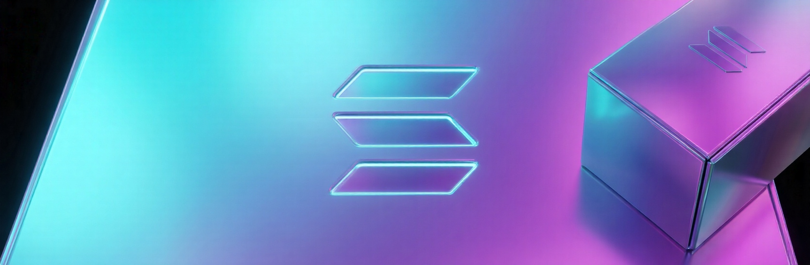
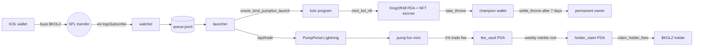

# KOLZ

<a href="https://github.com/Kolzoo/kolz-protocol/blob/main/LICENSE">
  
</a>
<a href="https://github.com/Kolzoo/kolz-protocol/actions">
  
</a>
<a href="https://github.com/Kolzoo/kolz-protocol/releases">
  
</a>
<a href="https://github.com/Kolzoo/kolz-protocol/commits">
  
</a>
<a href="https://github.com/Kolzoo/kolz-protocol/issues">
  
</a>
<a href="https://github.com/Kolzoo/kolz-protocol/stargazers">
  
</a>
<a href="https://kolz.fun">
  
</a>
<a href="https://github.com/coral-xyz/anchor">
  
</a>
<a href="https://docs.solana.com">
  
</a>
<a href="https://www.typescriptlang.org">
  
</a>

KOLZ binds Solana KOL identities to pump.fun launches. A KOL wallet that buys `$KOLZ`
enters a queue. When the oracle pulls the trigger, the wallet's memecoin auto-spawns
on pump.fun, a 1/1 holographic NFT is minted into escrow, a 7-day throne window opens,
and every trade fee feeds a vault that drops to `$KOLZ` holders on a keccak merkle root.

## Features

Status legend: `mainnet` = deployed + verified onchain · `devnet` = deployed + tested on devnet · `implemented` = code complete, awaiting mainnet deploy · `tested` = unit/integration coverage in CI

| Feature | Status |
| --- | --- |
| WebSocket KOL purchase detection (`$KOLZ` SPL transfers) | implemented |
| pump.fun token auto-launch via PumpPortal Lightning | implemented |
| Vanity mint grinding (`...pump` suffix) | implemented |
| Anchor program: `oracle_bind_pumpfun_launch` | devnet |
| Anchor program: `mint_kol_nft` (1/1 escrow + Metaplex V3 metadata) | devnet |
| Anchor program: `take_throne` (delegate-based NFT seize) | devnet |
| Anchor program: `settle_throne` (7-day permanent transfer) | devnet |
| Holder snapshot daemon + merkle distribution builder | implemented |
| Anchor program: `claim_holder_fees` (keccak merkle proof verification) | devnet |
| TypeScript SDK (in `sdk/`, importable from source) | implemented |
| Rust CLI (`kolz`) for ops, devnet inspection, vanity grinding | implemented |
| Devnet end-to-end test suite | tested |
| Mainnet program deploy | pending |

## Architecture



See [`docs/architecture.md`](docs/architecture.md) for the full system diagram and component table.

## Build

```bash
git clone https://github.com/Kolzoo/kolz-protocol.git
cd kolz-protocol

# Rust workspace: program + cli
cargo check --workspace
make build

# Anchor program (requires anchor 0.30.1 + solana 1.18.26)
anchor build

# TypeScript SDK
cd sdk && yarn && yarn build && cd ..

# Run the e2e devnet test suite
yarn ts-mocha -p ./tsconfig.json -t 1000000 tests/**/*.ts
```

## Quick start

The SDK is consumed from source until the npm publish lands. After running `cd sdk && yarn && yarn build`, import via a path / workspace dependency. The examples below show the published path that will be available after the npm publish.

```typescript
import { Connection, Keypair, sendAndConfirmTransaction, Transaction } from '@solana/web3.js';
// From source (current): import { KolzClient } from '../sdk/dist';
// From npm (after publish): import { KolzClient } from '@kolz/sdk';
import { KolzClient } from '@kolz/sdk';

const conn   = new Connection('https://api.mainnet-beta.solana.com', 'confirmed');
const oracle = Keypair.fromSecretKey(/* ... */);
const kolz   = new KolzClient(conn, /* programId */ 'Kolz1111111111111111111111111111111111111111');

// Bind a KOL wallet to its pump.fun mint after PumpPortal Lightning fired.
const bindIx = await kolz.bindPumpfunLaunch({
  oracle: oracle.publicKey,
  kolName: 'cented7',
  kolOwner: new PublicKey('CENTEDxxxxxxxxxxxxxxxxxxxxxxxxxxxxxxxxxx'),
  pumpMint: new PublicKey('Fk53EdYph8S9Pd24VggYBR3eAKbVYY4HU3wm7859CPpump'),
});

// Mint the 1/1 NFT into escrow with on-chain Metaplex V3 metadata.
const nftIx = await kolz.mintKolNft({
  oracle: oracle.publicKey,
  pet: kolz.derivePetPda(kolOwner, 'cented7'),
  name:   '@cented7 KOLZ',
  symbol: 'KOLZ',
  uri:    'https://api.kolz.fun/metadata/cented7.json',
});

const tx  = new Transaction().add(bindIx, nftIx);
const sig = await sendAndConfirmTransaction(conn, tx, [oracle]);
// returns: '5ejoQucZzjB37tJpnZFGjGx4r8ET78oPq4L1vdu8aPWtTPr4y3TgQm3jF6dvtZQd6UP8dAJeA25zKQZL6fbMCGMk'
```

```rust
use kolz_cli::{Rpc, IxSet};

let rpc = Rpc::mainnet()?;
let mut ixs = IxSet::new(rpc.program_id());

ixs.push(ixs.bind_pumpfun_launch(
    rpc.oracle()?,
    "cented7",
    "CENTEDxxxxxxxxxxxxxxxxxxxxxxxxxxxxxxxxxx".parse()?,
    "Fk53EdYph8S9Pd24VggYBR3eAKbVYY4HU3wm7859CPpump".parse()?,
)?);

let sig = rpc.send_with(ixs, &[rpc.oracle()?]).await?;
// returns: Signature(5ejoQucZzjB37t...)
```

## Project structure

```
kolz-protocol/
├── programs/kolz/
│   ├── src/
│   │   ├── lib.rs
│   │   ├── constants.rs
│   │   ├── errors.rs                       # 18 error variants
│   │   ├── utils.rs                        # name_bytes, slot_to_unix, pda helpers
│   │   ├── instructions/
│   │   │   ├── init_config.rs              # init_config(oracle, fee_basis_points)
│   │   │   ├── bind_launch.rs              # oracle_bind_pumpfun_launch
│   │   │   ├── mint_kol_nft.rs             # mint_kol_nft(name, symbol, uri)
│   │   │   ├── take_throne.rs              # take_throne (delegate seize)
│   │   │   ├── settle_throne.rs            # settle_throne (revoke delegate)
│   │   │   ├── commit_distribution_root.rs # commit_distribution_root(epoch, root, pool)
│   │   │   └── claim_holder_fees.rs        # claim_holder_fees(epoch, amount, proof)
│   │   └── state/
│   │       ├── config.rs                   # admin / oracle / fee_basis_points
│   │       ├── pet.rs                      # owner / kol_name / bonded_at
│   │       ├── launch.rs                   # pet / pump_mint / reserves / creator_fees
│   │       ├── king.rs                     # current_champion / champion_balance / settles_at_slot / settled
│   │       ├── distribution.rs             # epoch / root / pool_lamports / committed_at
│   │       └── holder_claim.rs             # holder / epoch / amount_claimed / claimed_at_slot
│   ├── idl/kolz.json
│   ├── Cargo.toml
│   ├── Xargo.toml
│   └── README.md
├── sdk/
│   ├── src/
│   │   ├── index.ts                        # re-exports KolzClient + types
│   │   ├── client.ts                       # KolzClient: connection + every ix wrapper
│   │   ├── instructions/                   # 7 instruction builders
│   │   ├── pdas.ts                         # derivePet / deriveLaunch / deriveKing / deriveDistribution / deriveHolderClaim
│   │   ├── discriminators.ts               # anchor 8-byte disc helpers
│   │   ├── borsh.ts                        # hand-rolled borsh layouts
│   │   ├── merkle.ts                       # keccak-256 merkle tree + proof verifier
│   │   ├── types.ts                        # Config / Pet / Launch / KingOfHill / Distribution / HolderClaim
│   │   ├── decoder.ts                      # raw bytes -> typed struct
│   │   ├── errors.ts                       # KolzError class hierarchy
│   │   └── util.ts                         # lamports/SOL, slot/sec, bs58 helpers
│   ├── package.json
│   └── tsconfig.json
├── cli/
│   ├── src/
│   │   ├── main.rs                         # clap-derived subcommands
│   │   └── cmd/                            # init / bind / mint_nft / take_throne / settle / commit_root / claim / inspect / grind
│   └── Cargo.toml
├── tests/
│   ├── kolz.ts                             # end-to-end happy path
│   ├── throne.ts                           # take + settle + NotTopHolder rejection
│   └── distribution.ts                     # 3-leaf merkle commit + claim
├── tests-rust/integration_test.rs          # in-process Bank exercise
├── examples/                               # 7 runnable ts-node scripts
├── docs/                                   # 12 reference docs (architecture, instructions, etc.)
├── .github/
│   ├── workflows/                          # ci.yml (fmt + check + gitleaks), release.yml (tag push)
│   ├── ISSUE_TEMPLATE/                     # bug_report, feature_request, config.yml
│   ├── PULL_REQUEST_TEMPLATE.md
│   ├── CODEOWNERS
│   ├── FUNDING.yml
│   ├── dependabot.yml
│   └── SUPPORT.md
├── .devcontainer/devcontainer.json
├── assets/banner.jpg
├── Anchor.toml
├── Cargo.toml
├── package.json
├── tsconfig.json
├── Makefile
├── Dockerfile
├── rust-toolchain.toml
├── rustfmt.toml
├── clippy.toml
├── .editorconfig
├── .gitattributes
├── .nvmrc
├── .env.example
├── README.md
├── LICENSE
├── CONTRIBUTING.md
├── CODE_OF_CONDUCT.md
├── CHANGELOG.md
├── SECURITY.md
├── CITATION.cff
└── AUTHORS
```

## Cost breakdown

| Action | Network cost | Notes |
| --- | --- | --- |
| pump.fun token creation | ~0.011 SOL | mint rent + Metaplex metadata rent + tx fee |
| Dev buy (minimum) | 0.0001 SOL | pump.fun bonding-curve minimum |
| Dev sell 100% | dust | one swap on the bonding curve, fees only |
| Anchor program deploy (mainnet) | ~5.3 SOL | one-time, recoverable on close |
| `mint_kol_nft` | ~0.012 SOL | KingOfHill PDA + NFT mint + ATA + Metaplex metadata rent |
| `take_throne` | ~0.000005 SOL | only network fee |
| `claim_holder_fees` | ~0.000005 SOL | only network fee |

## Latency

| Step | Median | Notes |
| --- | --- | --- |
| Watcher event detection | < 0.5 s | WS `logsSubscribe` on the parent mint |
| Lightning create RTT | ~0.7 s | PumpPortal hosted-wallet signing |
| `confirmed` commitment | ~1.0 s | mainnet-beta average 2 slots |
| Dev sell after hold | 10 s | configurable via `DEV_SELL_DELAY_MS` |
| 5-min cycle launcher | 300 s | drains queue one entry per cycle |

## Risk score

| Failure mode | Severity | Mitigation |
| --- | --- | --- |
| PumpPortal API outage | low | queue persists on disk; retry on next cycle |
| Vanity grind pool empty | low | grinder daemon refills; inline grind fallback |
| Oracle key compromise | high | re-key via `init_config` (admin signer) |
| Merkle root collision | very low | keccak-256 + per-epoch unique leaves |
| Front-run on `take_throne` | medium | challenger must hold the most tokens at submit time |

## Deployments

| Cluster | Program ID | Explorer | Status |
| --- | --- | --- | --- |
| devnet | `9bjyD3Vs6YBUUX5P6Tg2S4JZorbCiC4ZJjpzyQUeDvgJ` | [view](https://explorer.solana.com/address/9bjyD3Vs6YBUUX5P6Tg2S4JZorbCiC4ZJjpzyQUeDvgJ?cluster=devnet) | live, end-to-end test suite passing |
| mainnet-beta | not deployed | n/a | pending |

Build flags, rent math, and deployment runbook in [`docs/deployment.md`](docs/deployment.md).

## Contributing

Contribution guide: [`CONTRIBUTING.md`](CONTRIBUTING.md).
Code of conduct: [`CODE_OF_CONDUCT.md`](CODE_OF_CONDUCT.md).
Security disclosures: [`SECURITY.md`](SECURITY.md).
Support channels: [`.github/SUPPORT.md`](.github/SUPPORT.md).

## Links

- Website: [kolz.fun](https://kolz.fun)
- X: [@kolz_oo](https://x.com/kolz_oo)
- GitHub: [Kolzoo/kolz-protocol](https://github.com/Kolzoo/kolz-protocol)
- Ticker: `$KOLZ`
- Documentation: [`docs/`](docs/)

## License

MIT. See [`LICENSE`](LICENSE).
