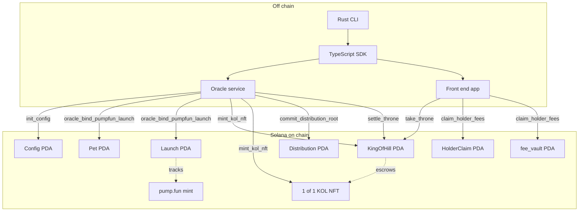

# KOLZ Architecture

KOLZ is a Solana program that binds a KOL identity (a "pet") to a pump.fun memecoin launch, then runs an on-chain "king of the hill" game over the resulting token. Holders periodically receive distributions of creator fees through a merkle-rooted claim flow. This document describes how the on-chain program, the off-chain oracle, the TypeScript SDK, and the Rust CLI fit together.

## Components

The system has four layers.

1. **On-chain program (`kolz`)**: An Anchor 0.30.1 program pinned to `solana-program = "=1.18.26"`. It owns the canonical state: `Config`, `Pet`, `Launch`, `KingOfHill`, `Distribution`, `HolderClaim`. All economic actions (take throne, settle, claim) are gated through it.
2. **Oracle service**: An off-chain signer that watches pump.fun bonding curve state. The oracle is the only signer allowed to call `oracle_bind_pumpfun_launch`, `mint_kol_nft`, `settle_throne`, and `commit_distribution_root`. Its pubkey is set at `init_config` time.
3. **TypeScript SDK (`@kolz/sdk`)**: A thin wrapper around the Anchor IDL. It exposes typed methods for each instruction, computes PDAs, and surfaces typed errors. See [client.md](./client.md).
4. **Rust CLI (`kolz`)**: A command line tool that wraps the SDK transport and the program's RPC surface for operators. See [cli.md](./cli.md).

## High level diagram

## Data flow

The protocol moves through five phases.

### Phase 1: configuration

The admin calls `init_config` once per deployment. This writes the oracle pubkey and the protocol fee in basis points into the `Config` PDA at seeds `["config"]`. Every subsequent oracle instruction verifies that the signer matches `config.oracle`.

### Phase 2: launch binding

When a KOL launches a pump.fun memecoin, the oracle observes the new mint and calls `oracle_bind_pumpfun_launch` with the KOL's display name (padded to 32 bytes), their wallet, and the pump.fun mint. The program derives:

- `Pet` PDA at `["pet", kol_owner, kol_name]`
- `Launch` PDA at `["launch", pet_pda]`

Both accounts are created if missing. After this point, the on-chain `Launch` row is the canonical record that "this pet's coin is this mint."

### Phase 3: NFT mint and throne setup

The oracle calls `mint_kol_nft`. This mints a 1/1 SPL token and attaches Metaplex Token Metadata V3. The NFT goes into an escrow ATA whose authority is the `KingOfHill` PDA at `["king", pet_pda]`. The escrow ATA's authority bump is stored on `KingOfHill` as `nft_escrow_vault_bump`. At this point `current_champion` defaults to the System Program address `11111111111111111111111111111111`, meaning "no champion yet."

### Phase 4: throne game

Holders compete to be the top holder of the pump.fun coin. Each call to `take_throne` verifies the challenger holds strictly more of the memecoin than `champion_balance`. The NFT is moved out of escrow on first capture, then between champion ATAs on subsequent captures, using the `KingOfHill` PDA as a delegate. The first successful capture sets `settles_at_slot = current_slot + 1_512_000`, locking the settlement deadline approximately 7 days ahead at 0.4 second slots. See [throne.md](./throne.md).

### Phase 5: settlement and distributions

After `settles_at_slot`, the oracle calls `settle_throne`. The PDA's delegate over the champion's ATA is revoked, freezing the throne. In parallel, the oracle batches creator fees per epoch, builds a keccak256 merkle tree of `(holder, epoch, amount)` leaves, and calls `commit_distribution_root`. Holders then call `claim_holder_fees` with their proof, and the program pays lamports out of `fee_vault` (PDA at `["fee_vault"]`). See [distributions.md](./distributions.md).

## State summary

| Account       | Seeds                                              | Size  | Writer                  |
| ------------- | -------------------------------------------------- | ----- | ----------------------- |
| Config        | `["config"]`                                       | 80 B  | admin (init), oracle    |
| Pet           | `["pet", kol_owner, kol_name]`                     | 80 B  | oracle                  |
| Launch        | `["launch", pet]`                                  | 120 B | oracle                  |
| KingOfHill    | `["king", pet]`                                    | 160 B | oracle, challengers     |
| Distribution  | `["distribution", epoch_le_bytes]`                 | 80 B  | oracle                  |
| HolderClaim   | `["holder_claim", holder, epoch_le_bytes]`         | 80 B  | holder                  |
| fee_vault     | `["fee_vault"]`                                    | 8 B   | program                 |

Sizes are upper bounds for rent math. See [deployment.md](./deployment.md) for the lamport conversion at 0.00000348 SOL per byte.

## Trust assumptions

- The admin can rotate the oracle key by reissuing `init_config` only if the admin authority is preserved.
- The oracle is trusted to publish accurate merkle roots. Holders verify their own inclusion proof against the on-chain root, so the oracle cannot inflate a specific holder's claim without producing a valid proof, but it can refuse to include a holder.
- The program does not custody pump.fun bonding curve liquidity. It only reads from observed state and records it.

See [security.md](./security.md) for the full threat model.

## Cross references

- Instruction-level reference: [instructions.md](./instructions.md)
- TypeScript SDK: [client.md](./client.md)
- CLI: [cli.md](./cli.md)
- Glossary: [glossary.md](./glossary.md)
