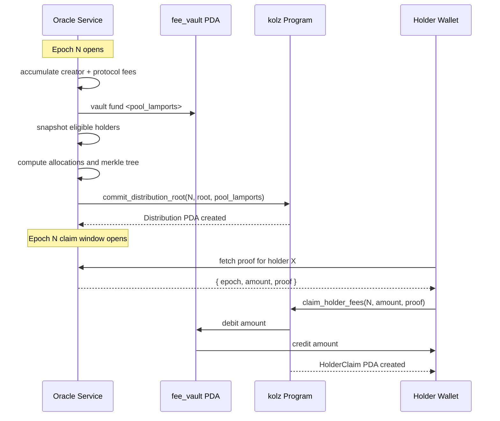

# Holder Fee Distributions

KOLZ distributes creator fees and protocol fees back to token holders on a per-epoch cadence. Each epoch the oracle builds a keccak256 merkle tree of `(holder, epoch, amount)` leaves and publishes the root on chain. Holders claim individually by submitting their inclusion proof. This document specifies the leaf layout, the tree construction, and the epoch lifecycle end to end.

## Epoch lifecycle



## Leaf encoding

The on-chain verifier computes a leaf as:

```text
leaf = keccak256(
    holder_pubkey_bytes      // 32 bytes, little endian native order
    || epoch_u64_le_bytes    // 8 bytes, little endian
    || amount_u64_le_bytes   // 8 bytes, little endian
)
```

Total preimage size is 48 bytes. The off-chain tree builder MUST match this exactly. The TypeScript SDK reference implementation is in `computeLeaf`:

```ts
import { keccak_256 } from "@noble/hashes/sha3";

export function computeLeaf(holder: PublicKey, epoch: bigint, amount: bigint): Uint8Array {
  const buf = new Uint8Array(48);
  buf.set(holder.toBytes(), 0);
  const dv = new DataView(buf.buffer);
  dv.setBigUint64(32, epoch, true);   // little endian
  dv.setBigUint64(40, amount, true);  // little endian
  return keccak_256(buf);
}
```

## Tree construction

Pair hashing is sorted: at each level, the two children are concatenated in ascending lexicographic byte order before hashing. This avoids needing to encode left or right direction in the proof.

```text
combine(a, b) = keccak256(min(a,b) || max(a,b))
```

For a leaf set `[L_0, L_1, ..., L_{n-1}]`:

1. If `n` is odd, the last leaf is duplicated (`L_{n-1}` paired with itself).
2. Build the next level by hashing each pair with `combine`.
3. Repeat until a single root remains.

The proof for leaf `L_i` is the list of sibling hashes from leaf level up to the root, omitting the root itself.

## On chain verification

```rust
fn verify_merkle_proof(proof: &[[u8; 32]], root: [u8; 32], leaf: [u8; 32]) -> bool {
    let mut current = leaf;
    for sibling in proof {
        let (a, b) = if current <= *sibling { (current, *sibling) } else { (*sibling, current) };
        let mut buf = [0u8; 64];
        buf[..32].copy_from_slice(&a);
        buf[32..].copy_from_slice(&b);
        current = solana_program::keccak::hashv(&[&buf]).to_bytes();
    }
    current == root
}
```

The verifier uses the Solana `keccak` syscall, which is gas-efficient and matches the Ethereum `keccak256` output byte for byte.

## Epoch numbering

Epochs are monotonic `u64` values controlled by the oracle. There is no enforced cadence on chain; the oracle can publish epoch 0, 1, 2, ... as fast or as slow as it wants. The recommended cadence is one epoch per 24 hours, anchored to UTC midnight.

The `Distribution` PDA uses `epoch.to_le_bytes()` as a seed, so each epoch has a unique PDA address. Re-committing the same epoch fails at PDA `init`.

## Single-claim enforcement

`HolderClaim` is keyed by `(holder_pubkey, epoch_le_bytes)`. Creating it via Anchor `init` guarantees only one successful claim per `(holder, epoch)` pair. A second call fails when attempting to allocate the PDA, and the program maps that failure path to `KolzError::AlreadyClaimed` for a clean error message.

## Pool accounting

`pool_lamports` on the `Distribution` PDA is informational. The on-chain claim path does not check that the sum of all `HolderClaim.amount_claimed` for an epoch equals `pool_lamports`. The oracle is trusted to:

1. Fund the `fee_vault` with at least `pool_lamports` before committing the root.
2. Build a tree whose leaf amounts sum to at most `pool_lamports`.

If the vault is over-funded, leftovers carry into the next epoch's pool. If under-funded, late claimers hit `InsufficientVault` and must wait for the vault to be topped up.

## Claim flow from a holder's perspective

```ts
import { KolzClient } from "@kolz/sdk";

const epoch = 42n;
const allocation = await fetch(`https://kolz-api.fly.dev/distributions/${epoch}/${holder.publicKey}`)
  .then(r => r.json());

// allocation = { amount: "12500000", proof: ["0x...", "0x...", ...] }

const sig = await client.claimHolderFees({
  holder,
  epoch,
  amount: BigInt(allocation.amount),
  proof: allocation.proof.map((p: string) => Buffer.from(p.replace(/^0x/, ""), "hex")),
});
```

The holder is the only signer required. The transaction pays its own fee in SOL.

## Recomputing the root

Anyone can independently verify a published root by:

1. Fetching the full allocation list for the epoch from the oracle API.
2. Recomputing leaves with `computeLeaf`.
3. Building the tree with `buildMerkleTree`.
4. Comparing `tree.root` against `distribution.root` read on chain.

This is the primary defense against an oracle that publishes a root inconsistent with its public allocation list. The protocol publishes a one-way commitment; verification is the holder community's responsibility.

## Error matrix

| Error                | When it fires                                           |
| -------------------- | ------------------------------------------------------- |
| `EpochNotCommitted`  | Distribution PDA for that epoch does not exist          |
| `InvalidProof`       | Computed root does not match stored root                |
| `AlreadyClaimed`     | HolderClaim PDA already exists for (holder, epoch)      |
| `InsufficientVault`  | fee_vault PDA balance below requested amount            |
| `InvalidAmount`      | amount is zero                                          |

## See also

- [instructions.md](./instructions.md) for the on-chain account schema.
- [client.md](./client.md) for SDK helpers.
- [security.md](./security.md) for trust analysis on the merkle path.
