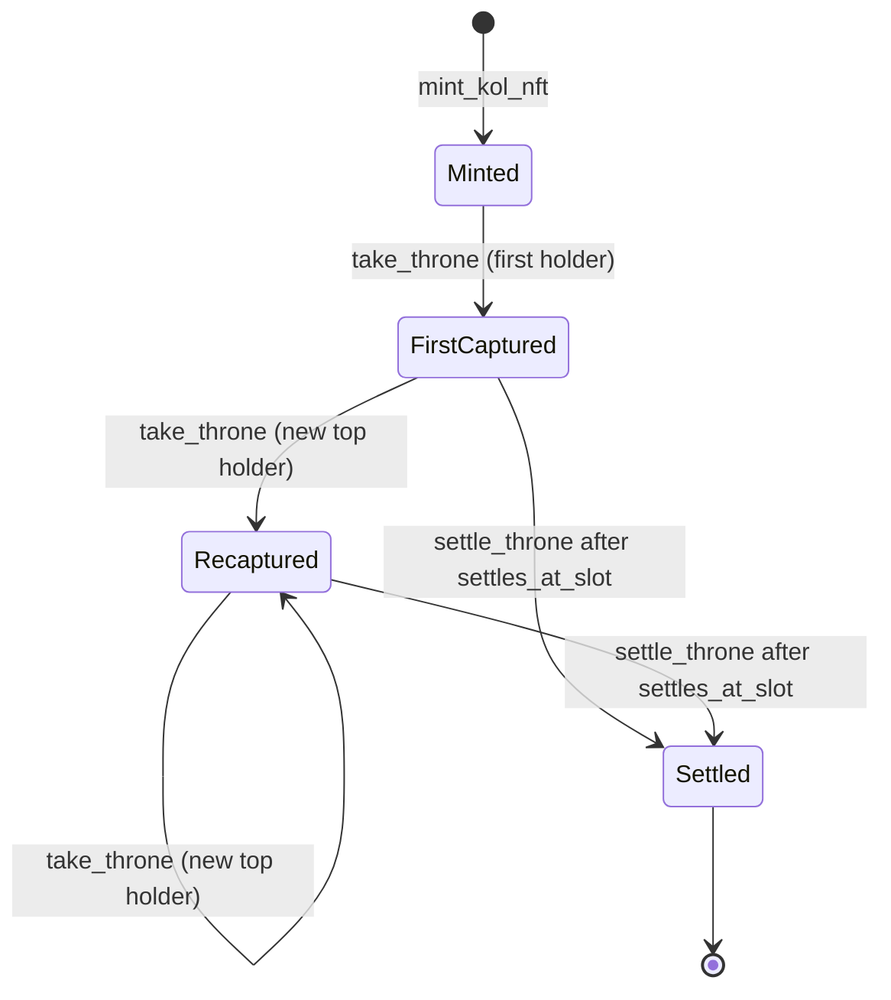
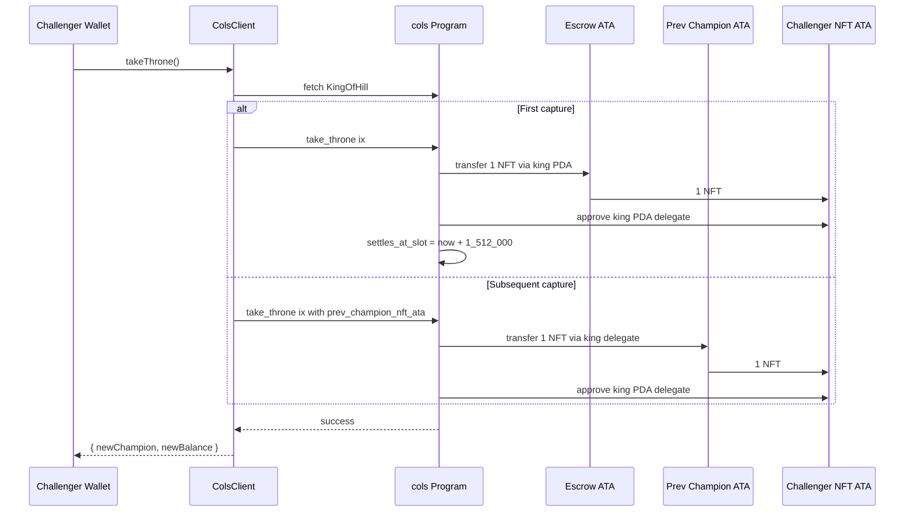

# Take The Throne

The "king of the hill" mechanic is the social and economic core of COLS. A single 1/1 NFT exists per KOL launch. Whoever holds the most of the launched memecoin holds the NFT. After approximately 7 days, the throne is permanently settled and the current holder keeps the NFT forever. This document explains the state transitions, the 7-day deadline math, and the edge cases the program handles.

## Lifecycle



## States

### Minted

After `mint_kol_nft`, the NFT lives in an escrow ATA whose authority is the `KingOfHill` PDA. The on-chain row reads:

```text
current_champion   = 11111111111111111111111111111111  (System Program)
champion_balance   = 0
take_overs         = 0
settles_at_slot    = 0
settled            = false
last_captured_slot = 0
```

This state is observable as "no champion yet" via the SDK.

### First captured

The first holder to call `take_throne` with any nonzero memecoin balance triggers two effects:

1. The NFT is transferred from the escrow ATA to the challenger's ATA. The signer of the transfer is the `KingOfHill` PDA, using the stored `nft_escrow_vault_bump`.
2. `settles_at_slot` is set to `current_slot + 1_512_000`.

`take_overs` becomes 1. `current_champion` is the challenger. `champion_balance` is the challenger's memecoin balance read from `challenger_pump_ata.amount`.

### Recaptured

Every subsequent `take_throne` requires a strictly greater balance. The NFT is moved out of the previous champion's ATA using the king PDA as delegate. The challenger then re-approves the king PDA as delegate over their own ATA, enabling the next capture.

If the previous champion has revoked the delegate via their own wallet, the transfer step fails. The on-chain code returns the SPL token error path, surfaced to the SDK as a generic token error rather than a COLS error. Front ends SHOULD detect this and explain the situation to the user.

`take_overs` increments by 1 on each successful capture.

### Settled

After `settles_at_slot`, any oracle call to `settle_throne` succeeds and:

- Revokes the king PDA's delegate over the champion's ATA.
- Sets `settled = true`.

From this point, the NFT is fully owned by the champion. Further `take_throne` calls fail with `SettlementPeriodEnded`. Further `settle_throne` calls fail with `AlreadySettled`.

## The 7-day deadline

The deadline is computed in slots, not wall clock. Solana mainnet targets 0.4 second slots, giving:

```text
1 day  = 86_400 seconds / 0.4 sec/slot = 216_000 slots
7 days = 7 * 216_000                   = 1_512_000 slots
```

The program stores the absolute deadline in `settles_at_slot` at the moment of first capture. Slot duration drift on mainnet historically averages slightly above 0.4 seconds, so the effective wall-clock window is typically 7.0 to 7.4 days.

### Why slots, not unix time

`Clock` exposes both `slot` and `unix_timestamp`. `unix_timestamp` is derived from validator votes and can drift several minutes on quiet clusters. `slot` is monotonic and gas-cheap to read. The slight wall-clock fuzz is acceptable for a 7-day game.

## Capture sequence



## Edge cases

### Tied balance

The capture check is strict: `balance > king.champion_balance`. A tied balance returns `NotTopHolder`. This avoids ambiguity when two wallets sync to the same value.

### Champion sold their bag

The program reads the challenger's memecoin balance, not the current champion's. If the current champion has sold their entire bag and `champion_balance` is still the historical high, a challenger needs to exceed that historical high, not the current champion's current balance. This is intentional: the throne should not be cheapened by the champion dumping after capture.

### Champion revoked delegate

If the current champion calls SPL `Revoke` on their own NFT ATA, the next `take_throne` will fail at the SPL `transfer` step because the king PDA no longer has authority. Resolution paths:

1. The current champion re-runs `take_throne` themselves with a higher balance, which would re-approve the delegate but only if their balance still beats `champion_balance` (it would, since they are the champion).
2. The protocol does not provide an admin recovery path in v1. A force-reclaim instruction is out of scope for v1.

### Oracle attempts settle early

`settle_throne` returns `SettlementNotReady` if `current_slot < settles_at_slot`. There is no privileged early-settle path.

### Multiple captures in the same slot

Slot is recorded as `last_captured_slot` but not used as a uniqueness key. Multiple captures within a single slot are allowed; each must be strictly greater than the previous.

## Replay protection

`take_throne` does not include a nonce. Replay protection comes from:

- The strict `>` check: a captured balance cannot be captured again without an external buy.
- The `settled` flag: after settlement no capture is possible.

The transaction itself is replay-protected by Solana's recent blockhash mechanism.

## See also

- [instructions.md](./instructions.md) for the per-account schema.
- [security.md](./security.md) for trust analysis.
- [pumpfun.md](./pumpfun.md) for how balances are observed on the bonding curve.
